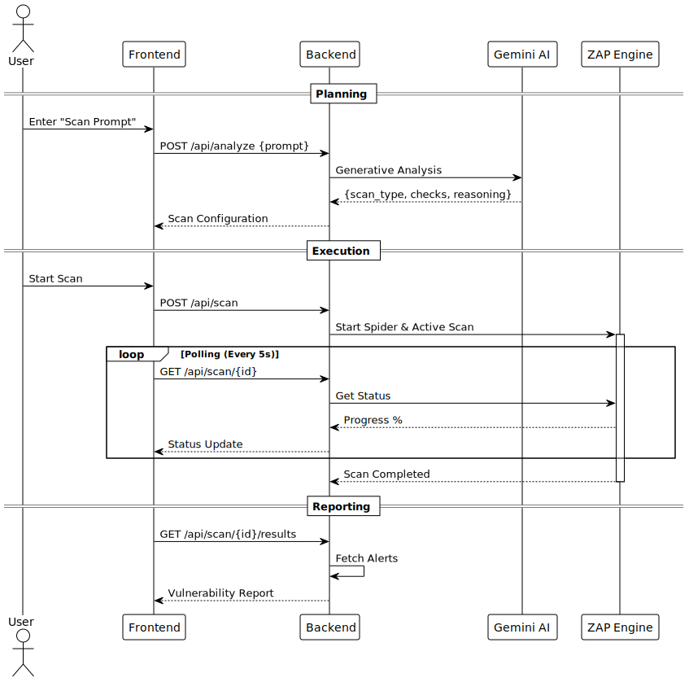

# Architecture & Topology

## Overview
The Automated Cognitive DAST system is designed as a modular, containerized application that leverages Generative AI to orchestrate traditional security scanning tools interactively.

## Topology
The system runs as a unified service in Google Cloud Run, encapsulating the Frontend, Backend, and ZAP Engine within a single container execution boundary to maximize performance and minimize latency.

### Components
1.  **Frontend (React/Vite)**: 
    *   Provides the user interface for configuring scans.
    *   Visualizes real-time progress and results.
    *   Communicates with the Backend via REST API (relative paths).
2.  **Backend (FastAPI)**:
    *   **Orchestrator**: Manages the lifecycle of ZAP scans.
    *   **AI Integrator**: Translates natural language prompts into ZAP configuration (Spider depth, Policy Strength, specific Scan Rules) using Gemini 1.5 Pro.
    *   **Proxy Interface**: Bridges the frontend to the internal ZAP API running on `localhost:8090`.
3.  **Engine (OWASP ZAP)**:
    *   Runs in "Daemon" mode.
    *   Executes Spidering (Crawling) and Active Scanning (Attacking).
    *   Shared memory space with Backend allowing efficient data transfer.

## Sequence Flow
The following diagram illustrates the lifecycle of an AI-Assisted Scan:

1.  **Intent Analysis**: The user's prompt (e.g., "Check for SQLi") is sent to Gemini.
2.  **Configuration**: Gemini returns a JSON configuration selecting relevant ZAP rules.
3.  **Execution**: The Backend initializes the ZAP spider and active scanner.
4.  **Polling**: The Frontend continuously polls the Backend/ZAP for status updates.
5.  **Reporting**: Final results are aggregated and presented to the user.
