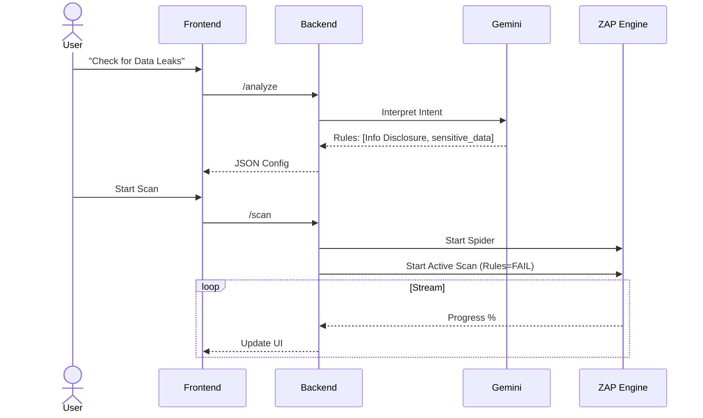
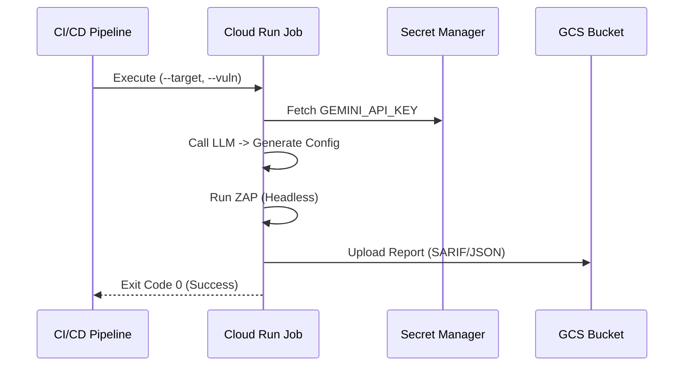

# Architecture: Automated Cognitive DAST

## 1. System Overview

**Automated Cognitive DAST** is an enterprise-grade security scanning platform that bridges the gap between traditional DAST tools (OWASP ZAP) and modern Generative AI (Google Gemini). It allows users to define security requirements in natural language, which are then translated into precise, optimized scan policies.

The system operates in two core modes:
1.  **Interactive Mode (GUI)**: A stateful web application for real-time scanning and analysis.
2.  **Ephemeral Mode (Headless)**: A serverless, fire-and-forget job optimized for CI/CD pipelines.

---

## 2. High-Level Topology

The solution leverages Google Cloud Run for serverless scale, Secret Manager for credential security, and GCS for report compliance.

```mermaid
graph TD
    User[User / CI/CD] -->|HTTPS| WebApp[Cloud Run Service\n(Web App)]
    User -->|gcloud run jobs| Job[Cloud Run Job\n(Ephemeral Scanner)]
    
    subgraph "Cloud Run Service"
        UI[React Frontend]
        API[FastAPI Backend]
        ZAP_S[ZAP Service]
        LLM_S[LLM Service]
        UI --> API
        API --> ZAP_S
        API --> LLM_S
    end
    
    subgraph "Ephemeral Job"
        MCP[MCP Logic]
        ZAP_H[ZAP Headless]
        MCP --> ZAP_H
    end
    
    WebApp -->|Analyze| Gemini[Google Gemini API]
    Job -->|Config| Gemini
    
    WebApp -->|Scan| Target[Target Application]
    Job -->|Scan| Target
    
    Job -->|Fetch Key| Secrets[Secret Manager]
    Job -->|Upload| GCS[GCS Bucket]
```

---

## 3. Core Components

### 3.1. Analytical Engine (The "Brain")
*   **LLM Integration**: Uses Google Gemini 1.5 Pro to interpret user prompts (e.g., "Check for IDOR").
*   **Cognitive Translation**: Maps natural language to specific ZAP Active Scan Rules (IDs), setting thresholds to `FAIL`.
*   **Safety**: Enforces "Block None" for security testing context but filters irrelevant generation.

### 3.2. Execution Engine (OWASP ZAP)
*   **Unified Container**: Both modes use a custom Docker image extending `ghcr.io/zaproxy/zaproxy:stable`.
*   **Optimization**: Pre-configured with performance tuning (`-config api.disablekey=true`, memory flags).
*   **Artifacts**: Generates industrial-standard reports (SARIF, JSON, HTML).

---

## 4. Execution Flows

### 4.1. Interactive AI Scan (GUI)
This flow emphasizes user feedback and real-time validation.



### 4.2. CI/CD Ephemeral Scan
This flow emphasizes automation, security, and persistence.



---

## 5. Security & Compliance

*   **Secrets Management**: No hardcoded API keys. The ephemeral job binds strictly to **Google Secret Manager** secrets at runtime (`/config/llm_config.json`).
*   **Identity**: Uses a dedicated Service Account (`auto-cognitive-DAST-identity`) with minimal privileges (GCS Object Creator, Secret Accessor).
*   **Persistence**: All compliance reports are stamped with UTC timestamps and archived in a GCS Bucket (`gs://...-reports`) for audit trails.

---

## 6. Design Resources
For editable diagrams, see the `Design/` directory:
*   [System Topology](../Design/puml/system_topology.puml)
*   [GUI Sequence](../Design/puml/gui_scan_sequence.puml)
*   [Ephemeral Sequence](../Design/puml/ephemeral_scan_sequence.puml)
