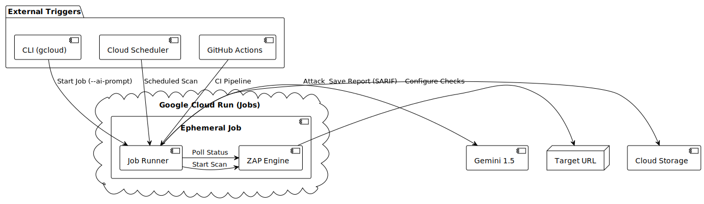

# Ephemeral Headless Mode

## Why Ephemeral?
Traditional DAST tools are often heavy, long-running processes that require dedicated infrastructure. The **Ephemeral Mode** allows you to run a security scan as a serverless "Job" that spins up, performs the scan, reports results, and shuts down instantly. This is ideal for:
*   **CI/CD Pipelines**: Blocking builds on security failures.
*   **Scheduled Scans**: Running nightly baselines without paying for 24/7 server uptime.
*   **Event-Driven Security**: Triggering a scan automatically when a new deployment occurs.

## Topology & Flow
The ephemeral job bypasses the UI and interacts directly with the orchestration logic via CLI arguments.



## How It Works
The system uses the same Docker image as the service, but triggers a dedicated entrypoint script (`job_runner.py`).
1.  **Trigger**: `gcloud run jobs execute` or `docker run`.
2.  **AI Config (Optional)**: If (`--ai-prompt`) is provided, the job consults Gemini to determine the scan strategy.
3.  **Scan**: ZAP executes the scan in headless mode.
4.  **Report**: Results are saved to a GCS bucket or stdout.
5.  **Termination**: The container exits.

## Running an Ephemeral Scan

### Prerequisites
*   Google Cloud Project (if running on Cloud Run)
*   Gemini API Key

### Command (Cloud Run)
To run a scan against `https://example.com` checking for data harvesting risks:

```bash
gcloud run jobs execute zap-mcp-server-job \
  --region us-central1 \
  --args="--url=https://example.com" \
  --args="--ai-prompt=I want to check if this target is susceptible to data harvesting attacks" \
  --args="--format=json" \
  --args="--output=report.json"
```

### Command (Local Docker)
```bash
docker run --rm \
  -e GEMINI_API_KEY=$GEMINI_API_KEY \
  automated-cognitive-dast \
  python3 job_runner.py \
  --url https://example.com \
  --ai-prompt "Check for IDOR vulnerabilities"
```
