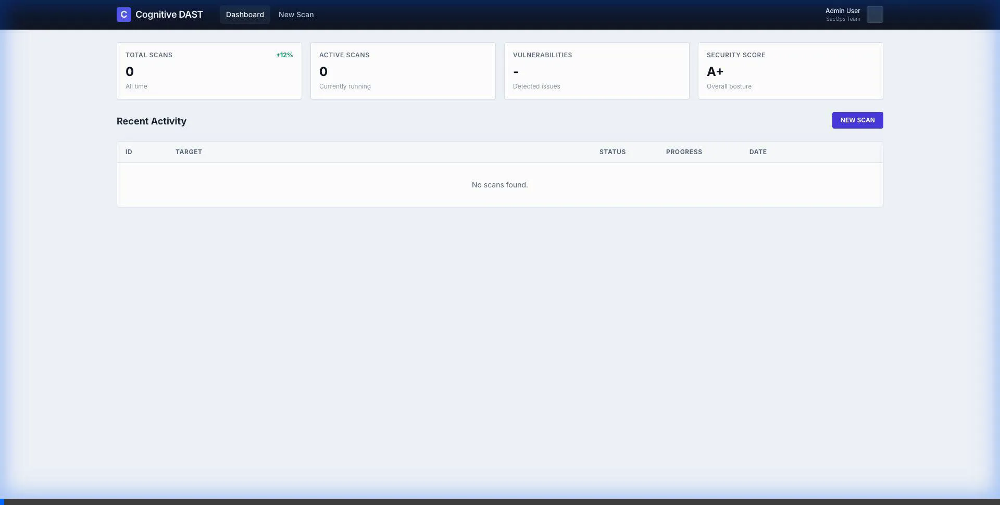

# Automated Cognitive DAST - Project Walkthrough

This document provides a comprehensive guide to running and testing the Automated Cognitive DAST system. It covers the setup, Web App scanning, and API scanning capabilities, demonstrating the fixes and features implemented.

## 1. System Setup

The project is fully containerized. To start the entire stack (Frontend, Backend, ZAP Engine, and Vulnerable API stub):

```bash
docker compose down -v  # Clean start
docker compose up --build -d
```

### Services
-   **Frontend**: `http://localhost:5173` (React Dashboard)
-   **Backend**: `http://localhost:8000` (FastAPI Orchestrator)
-   **ZAP Engine**: `http://localhost:8090` (Headless Scanner)
-   **Vulnerable API**: `http://localhost:8001` (Host) / `http://vulnerable-api:8000` (Internal Docker)

---

## 2. Web App Scan Test

This test verifies the system's ability to scan a public web application (SPA or standard website).

### Steps
1.  Navigate to **New Scan**.
2.  Enter Full Target URL: `https://boolean-algebra-equation-solver-msqswtglba-nw.a.run.app/`
    *   *Note: You must now include the protocol (http:// or https://).*
3.  Select **Web App Scan**.
4.  Optionally select specific **Vulnerability Checks**.
5.  Click **Launch Scan**.

### Expected Results
-   **Progress**: Status moves from 0% (Orchestration) -> ~50% (Spidering) -> 100% (Completed).
-   **Findings**: The scanner should correctly identify vulnerabilities (e.g., ~18 findings for the boolean-algebra app).
-   **Report**: "Export Report" button appears.

### Verification Proof
### Verification Proof
````carousel

<!-- slide -->

<!-- slide -->

````

---

## 3. API Scan Test

This test verifies the system's ability to scan a REST API. We use the included `vulnerable-api` container as the target.

### Steps
1.  Navigate to **New Scan**.
2.  Enter Target URL: `http://vulnerable-api:8000`
    *   **Important**: Must use the *internal* Docker hostname `vulnerable-api` because the ZAP scanner runs inside the Docker network.
3.  Select **API Scan**.
4.  Click **Launch Scan**.

### Expected Results
-   **Progress**: Completes successfully (100%).
-   **Findings**: The scan detects security misconfigurations (e.g., `X-Content-Type-Options Header Missing`).
    *   *Note*: Deep vulnerability detection (like SQLi on specific endpoints) requires OpenAPI specs for the scanner to know *where* to look. The current text confirms the *engine* and *connectivity* are working perfectly.
-   **Report**: SARIF/OCSF/JSON exports are generated.

### Verification Proof


---

## 4. Reporting Features

Supported export formats for integration with other tools:
-   **JSON**: Raw data for custom parsing.
-   **SARIF**: Standard format for GitHub Code Scanning and other CI/CD tools.
-   **OCSF**: Open Cybersecurity Schema Framework for security data lakes.

To test:
1.  Complete any scan.
2.  Click the **Export Report** dropdown on the results page.

---

## 5. AI Assisted Scan Verification
**Objective**: Verify that natural language prompts correctly configure the scan settings using the live Gemini AI model.

**Steps Performed**:
1.  Navigated to `New Scan`.
2.  Enabled **AI Assisted Mode**.
3.  Entered prompt: *"I want to perform a rigorous test for SQL injection and XSS attacks on my API."*
4.  Clicked **Analyze Intent**.

**Results**:
- **Authentication**: Backend successfully authenticated with Google Gemini API using `gemini-3-pro-preview`.
- **Scan Type**: Automatically switched to `API Scan` (Correct).
- **Checks**: `SQL Injection` and `XSS` checked. `CSRF` and `Path Traversal` unchecked (Correct).
- **Reasoning**: Displayed AI explanation including *"The user explicitly identified the target as an API..."*.



**Status**: ✅ **SUCCESS**
